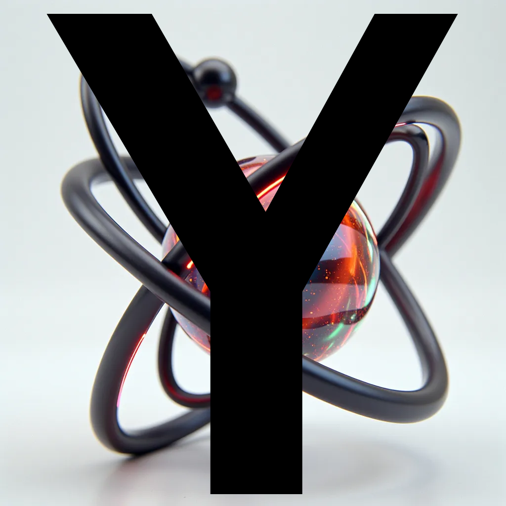

<html><body>
CONTROLS: WASD (with caps lock), arrow keys, +/- to zoom in/out Also that should've been a 2D console physics engine, but no<h1>compile <code><a  href="https://github.com/YOUWILLDIE666/PhysY/blob/master/PhysY-0.2.0D.cpp">PhysY-0.2.0D.cpp</a></code> and run it</h1>
</body></html>